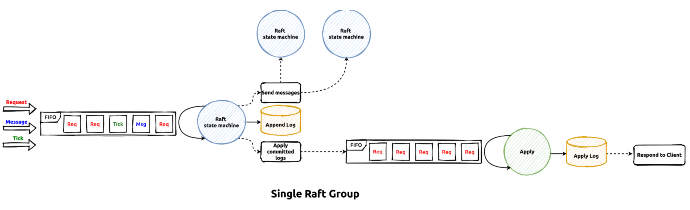

### **Raft 共识算法**

Raft 是一种分布式系统中的共识算法，用于在分布式环境中保证多个副本节点的一致性。相比其他算法（如 Paxos），Raft 以易于理解和实现为目标，是一种教学友好型的共识算法。

---

### **核心目标**
Raft 的主要目标是：
1. **Leader 选举**：在集群中选举出一个 Leader，负责协调日志复制和事务提交。
2. **日志复制**：在所有节点之间同步操作日志，保证一致性。
3. **安全性**：保证在存在网络分区或节点故障的情况下，仍然能够保持数据一致性。
4. **可用性**：只要大多数节点存活，系统可以继续提供服务。

---

### **核心组成**
Raft 算法将问题拆分为三个部分：
1. **Leader 选举**
2. **日志复制**
3. **日志提交和状态机应用**

---

### **状态与角色**
在 Raft 中，每个节点有三种可能的状态：
- **Leader**：负责处理所有客户端请求并同步日志到 Follower。
- **Follower**：被动地接受 Leader 的指令。
- **Candidate**：在 Leader 失效时发起选举，竞争成为新的 Leader。

节点在不同状态间切换的规则：
- **Follower → Candidate**：超时时未收到 Leader 的心跳。
- **Candidate → Leader**：赢得选举（获得大多数节点的投票）。
- **Candidate → Follower**：检测到另一个合法的 Leader。
- **Leader → Follower**：检测到新一轮选举且另一个节点成为 Leader。

---

### **Raft 的核心机制**
#### 1. **Leader 选举**
- **触发条件**：如果 Follower 在 `election timeout` 内未收到 Leader 的心跳信号（`AppendEntries` 请求），它会成为 Candidate 并发起选举。
- **选举过程**：
  - 每个 Candidate 增加自己的任期号（Term）。
  - 发送 `RequestVote` 请求给其他节点，拉取选票。
  - 如果收到大多数节点的投票，成为 Leader。
  - 如果有多个 Candidate 同时发起选举，可能会导致选票分裂（Split Vote），此时会等待超时并重新选举。

#### 2. **日志复制**
- **日志结构**：
  - 日志由一系列有序条目组成，每条日志包含：
    - `term`：日志被创建时的任期号。
    - `index`：日志的索引位置。
    - `command`：客户端提交的操作。
- **日志同步过程**：
  1. Leader 接收客户端请求，将命令写入自己的日志。
  2. Leader 通过 `AppendEntries` 将日志同步到所有 Follower。
  3. Leader 收到大多数节点的确认后，提交日志并应用到状态机。
  4. Leader 通知所有 Follower 提交日志。

#### 3. **日志提交和状态机应用**
- **日志一致性检查**：
  - Leader 通过日志的 `term` 和 `index` 检查 Follower 的日志是否与自己一致。
  - 如果不一致，Leader 会回滚 Follower 的日志，直到找到匹配点。
- **日志提交规则**：
  - Leader 确保某条日志被大多数节点存储后，才能将其标记为提交状态。
  - 提交后的日志才能应用到状态机，保证数据一致性。

---

### **关键点**
#### **1. 心跳机制**
- Leader 定期向 Follower 发送心跳（空的 `AppendEntries` 请求）以维持领导地位。

#### **2. Term 和日志索引**
- Term 是 Raft 的任期概念，用于区分不同的选举周期。
- 日志条目包含 `(term, index)` 元组，用于标识日志的唯一性。

#### **3. 大多数原则**
- Raft 依赖多数派（`majority quorum`）来做出决策。只要大多数节点存活，系统就能正常运行。

---

### **Raft 的特点**
1. **清晰的职责分离**：将共识过程分为 Leader 选举、日志复制和状态机应用，易于理解和实现。
2. **强一致性**：通过大多数派原则和日志一致性检查，保证系统的线性一致性。
3. **容错性**：在节点故障或网络分区时，仍然能通过 Leader 切换继续提供服务。

---

### **代码实现中的关键步骤**
1. **Leader 选举**
   - 计时器（Election Timeout）：在超时后发起选举。
   - 发送 `RequestVote` 并处理选票。
2. **日志同步**
   - 实现 `AppendEntries` 请求，进行日志复制和一致性检查。
   - 确保日志的正确回滚和更新。
3. **日志提交**
   - Leader 检查日志是否已被大多数节点存储。
   - 标记为提交并应用到状态机。

---

Raft 被广泛应用于分布式系统的领导者选举和日志同步，如 Etcd 和 Consul。它的明确设计和易用性使其成为教学和实际应用中的首选共识算法。如果你对具体的实现感兴趣，可以深入探讨代码细节。





这张图展示了 **Raft 分布式一致性协议的核心工作流程**，重点是如何处理客户端请求、内部消息和日志复制，最终将结果提交到状态机并响应客户端。以下是对图中每部分的详细解释：

---

## **1. 输入请求**
图的左侧展示了三种输入类型，它们进入了一个 **FIFO 队列（先进先出队列）**：

1. **Request（红色箭头）**：
   - 来自客户端的请求（如写入操作或读取操作）。
   - 写入操作会被转化为日志条目（Log Entry）以便进行一致性复制。

2. **Message（蓝色箭头）**：
   - Raft 节点之间的内部消息，例如选举消息（Vote Request）或日志复制消息（AppendEntries）。
   - 这些消息用于维持分布式系统的一致性和高可用性。

3. **Tick（绿色箭头）**：
   - 定时器触发的事件（通常是心跳超时）。
   - 触发 **选举超时** 或 **发送心跳**，是 Raft 协议中保持 Leader 和 Follower 协作的重要机制。

---

## **2. FIFO 队列**
- **FIFO 队列（先进先出队列）**：
  - 所有输入事件都会进入这个队列，按照顺序处理。
  - 队列中的事件类型有：
    - **Req**：客户端请求。
    - **Msg**：节点之间的 Raft 消息。
    - **Tick**：定时器事件。

---

## **3. Raft 状态机**
### **核心组件**
- **Raft 状态机** 是 Raft 协议的核心部分，它会处理 FIFO 队列中的事件。
- 主要职责包括：
  1. **处理选举**：
     - 如果是选举超时（由 `Tick` 触发），Raft 状态机会发起选举。
  2. **日志复制**：
     - 如果是客户端请求，Raft 状态机会将请求转化为日志条目并通过 `Append Log` 将日志复制到其他节点。
  3. **一致性维护**：
     - 如果是 Raft 消息（如心跳或日志同步），状态机会根据消息内容更新自身状态或回应对方。

### **输出**
- Raft 状态机可能输出以下结果：
  - **发送消息（Send Messages）**：
    - 将日志复制请求、选举投票结果等消息发送给其他节点。
  - **追加日志（Append Log）**：
    - 将客户端请求对应的操作（如写操作）追加到日志中，以备提交和应用。
  - **提交日志（Apply Committed Logs）**：
    - 当某个日志条目被大多数节点确认时，标记为已提交（Committed），并将其传递给状态机应用。

---

## **4. 日志应用（Apply Logs）**
### **日志应用过程**
1. **已提交日志队列**：
   - 提交的日志条目会进入另一个 FIFO 队列，等待应用到状态机。
   - 这些日志可能包含写入操作或其他对存储系统的变更。

2. **应用日志到状态机**：
   - 提交的日志条目会被应用到状态机（如更新存储中的数据）。

### **输出**
- 状态机应用完日志后，生成最终结果：
  - **响应客户端**：
    - 如果是客户端写入请求，则将结果返回给客户端。
    - 如果是读取请求，则直接返回对应数据。

---

## **5. 整体流程总结**
### **输入处理**：
- **来自客户端的请求** 会通过 Raft 状态机转化为日志条目并复制到其他节点。
- **来自节点的消息** 用于维护 Raft 的一致性（如选举、心跳和日志复制）。
- **定时器触发** 保证协议正常运行（如触发选举或发送心跳）。

### **日志复制与提交**：
- 客户端的写请求会被追加到日志中，通过 Raft 的日志复制机制确保日志在大多数节点上都存在。

### **状态机应用**：
- 已提交的日志条目会被应用到状态机。
- 最终结果通过状态机返回给客户端。

---

## **关键机制**
1. **FIFO 队列**：
   - 确保事件按照时间顺序处理，保证一致性。

2. **Raft 状态机**：
   - Raft 的核心模块，负责选举、日志复制和一致性维护。

3. **日志提交和应用**：
   - 保证客户端请求的结果被正确应用到状态机，达到最终一致性。

---

## **典型应用场景**
1. **分布式数据库**：
   - Raft 保证写操作的强一致性，多个节点协作提供高可用的键值存储服务。

2. **分布式文件系统**：
   - 客户端写入的数据通过 Raft 一致性协议复制到多个存储节点，确保可靠性。

---

如果需要深入探讨 Raft 的某个机制（如日志复制、选举过程等），可以进一步展开！


---

### **RawNode 的概述**
`RawNode` 是 Raft 实例的一个包装（Wrapper），它提供了更高级的接口（如 `Step`、`Ready` 和 `Advance`），方便上层模块驱动 Raft 进程。`RawNode` 本身和内部的 Raft 实例不直接处理消息的发送和日志的持久化，而是通过 `Ready` 结构体输出这些任务，由上层模块完成。

---

### **核心概念与职责**

#### **1. RawNode 的作用**
- `RawNode` 是对底层 Raft 实例的封装，它将底层复杂的 Raft 逻辑暴露为更简单的接口，供上层模块调用。
- `RawNode` 本身不会执行消息发送、日志持久化等实际操作，而是生成一个 `Ready` 结构体，供上层模块处理。

---

#### **2. Raft 工作流中的 `RawNode` 位置**
- **输入**：`RawNode` 接收来自上层的事件，例如：
  - **客户端请求**：如写入、读取等。
  - **Raft 消息**：来自其他节点的 Raft 协议消息（如心跳或投票请求）。
  - **定时器事件**：如选举超时。
- **输出**：`RawNode` 将生成一个 `Ready` 结构体，包含：
  - 需要发送的消息。
  - 需要持久化的日志条目。
  - 已提交的日志条目等。

这些输出结果由上层模块进一步处理。

---

### **核心接口**

#### **1. `Step` 接口**
- **作用**：
  - 处理外部输入的消息，例如客户端请求或来自其他节点的 Raft 消息。
- **调用方式**：
  - 例如，处理客户端写请求时：
    - `RawNode.Step(...)` 将客户端请求封装为日志条目。
  - 或者，接收到其他节点的消息时：
    - `RawNode.Step(...)` 更新 Raft 实例的状态。
- **核心逻辑**：
  - 更新内部 Raft 实例的状态（如日志、选票等）。

---

#### **2. `Ready` 接口**
- **作用**：
  - `Ready` 是 Raft 实例的输出，包含需要由上层模块处理的内容，例如：
    1. **需要发送的消息**（`Messages`）：上层模块需要将这些消息发送给其他节点。
    2. **需要持久化的日志条目**（`Entries`）：上层模块需要将这些日志写入存储。
    3. **已提交的日志条目**（`CommittedEntries`）：上层模块需要将这些日志应用到状态机。
    4. **当前的快照**（`Snapshot`，如果有）。
- **调用方式**：
  - 上层调用 `RawNode.Ready()` 获取 Raft 实例的输出。
- **举例**：
  ```go
  rd := rawNode.Ready()
  // 持久化日志条目
  storage.Save(rd.HardState, rd.Entries, rd.Snapshot)
  // 发送消息给其他节点
  for _, msg := range rd.Messages {
      send(msg)
  }
  ```

---

#### **3. `Advance` 接口**
- **作用**：
  - 通知 `RawNode` 上层已经处理完 `Ready` 中的数据。
  - 例如，日志已经持久化，消息已经发送，`RawNode` 可以继续处理新的事件。
- **调用方式**：
  - 在处理完 `Ready` 结果后，调用 `RawNode.Advance()`。

---

### **`Ready` 结构体详解**
`Ready` 是 Raft 实例的输出数据结构，主要包含以下几个重要字段：

1. **`Entries`**：
   - 新生成但尚未持久化的日志条目。
   - 需要上层模块将这些日志条目持久化到存储中。

2. **`CommittedEntries`**：
   - 已经提交的日志条目，说明这些日志已经在大多数节点中达成一致。
   - 上层模块需要将这些日志应用到状态机。

3. **`Messages`**：
   - Raft 协议中需要发送给其他节点的消息。
   - 例如，心跳消息、日志复制请求等。

4. **`Snapshot`**：
   - 如果当前状态包含快照数据，会通过这个字段输出。
   - 上层模块需要将快照存储到持久化引擎中。

5. **`SoftState`**（可选）：
   - 当前节点的非持久化状态，例如是否为 Leader。

6. **`HardState`**（可选）：
   - 当前节点的持久化状态，例如当前的任期号（Term）、投票信息等。

---

### **工作流总结**

#### **1. 工作流图**
以下是 `RawNode` 的工作流程：
1. 上层通过 `Step` 传递事件到 `RawNode`。
2. `RawNode` 驱动底层 Raft 实例，生成 `Ready`。
3. 上层通过 `Ready` 接口获取输出数据：
   - 发送消息。
   - 持久化日志。
   - 应用提交的日志条目。
4. 上层完成处理后，调用 `Advance` 通知 `RawNode`，继续下一步。

#### **2. 总结**
- `RawNode` 是 Raft 的高级接口，封装了复杂的底层逻辑。
- 上层模块需要配合 `Ready` 和 `Advance` 完成消息发送和日志持久化。

---

### **示例代码**
以下是 `RawNode` 的典型使用示例：

```go
// 初始化 RawNode
rawNode, err := raft.NewRawNode(config)

// 接收事件
rawNode.Step(raftpb.Message{Type: raftpb.MsgProp, Entries: []raftpb.Entry{{Data: []byte("write data")}}})

// 获取 Ready
rd := rawNode.Ready()

// 持久化日志
storage.Save(rd.HardState, rd.Entries, rd.Snapshot)

// 发送消息
for _, msg := range rd.Messages {
    send(msg)
}

// 应用提交的日志
for _, entry := range rd.CommittedEntries {
    apply(entry)
}

// 通知 RawNode 已完成
rawNode.Advance()
```

---

### **总结**
- **`RawNode` 的作用**：封装底层 Raft 逻辑，提供简单的接口供上层驱动。
- **核心接口**：
  1. `Step`：处理输入事件。
  2. `Ready`：输出需要处理的内容（消息、日志等）。
  3. `Advance`：通知已完成处理。
- **上层职责**：负责发送消息、持久化日志以及应用提交的日志条目。

如果需要进一步了解某个细节（如 `Ready` 的字段或 Raft 的消息类型），可以进一步展开！